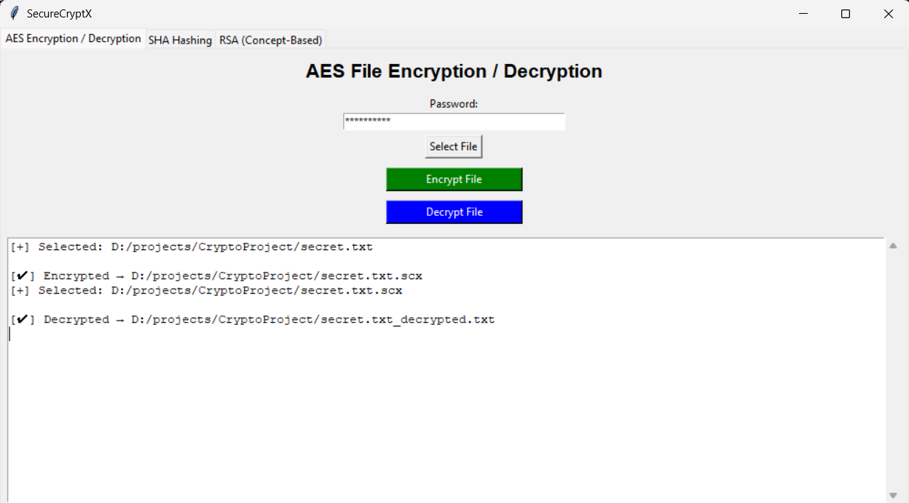
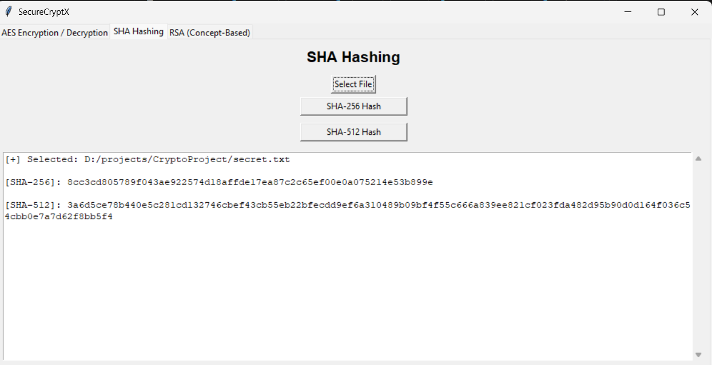
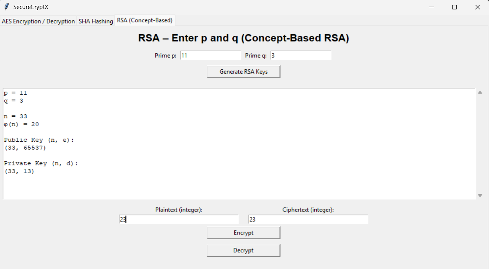

# 🔐 SecureCryptX – Cryptography GUI Suite  
_A Concept-Based Cybersecurity Project_

SecureCryptX is a **GUI-based cryptography tool** built using **Python & Tkinter**.  
It allows users to perform **AES encryption**, **SHA hashing**, and most importantly,  
a **concept-based RSA implementation** where the user enters **prime numbers p and q**
and the program calculates:

- n = p × q  
- φ(n) = (p − 1)(q − 1)  
- Public exponent `e`  
- Private exponent `d`  
- RSA Public Key → (n, e)  
- RSA Private Key → (n, d)

This demonstrates the **core mathematical working behind RSA**,  
making it ideal for **academic projects, viva, ethical hacking demonstrations, and learning cryptography.**

## 🧠 Project Features

### 🔑 RSA (Concept-Based Implementation)
✔ User enters primes `p` and `q`  
✔ GUI calculates `n`, `φ(n)`, `e`, `d`  
✔ Generates Public & Private Keys  
✔ Perform RSA encryption & decryption  
✔ Random Prime Generator included  
✔ Best for learning and presentations  

### 🔒 AES Encryption (File-Based)
✔ Encrypt any file using a password  
✔ Decrypt using the same password  
✔ Output saved as `.scx` file  

### 🧾 SHA Hashing (Integrity Check)
✔ Compute SHA-256  
✔ Compute SHA-512  
✔ Used in password storage & digital signatures  

## ▶️ How to Run the Project

1. Create Environment:
   ```
   python -m venv venv
   venv\Scripts\activate   # Windows
   ```

2. Install dependencies:
   ```
   pip install pycryptodome
   ```

3. Run GUI:
   ```
   python securecryptx_gui.py
   ```

## 📂 Project Structure

CryptoProject/
├── securecryptx_gui.py
├── aes_module.py
├── sha_module.py
├── README.md
└── requirements.txt


## 📸 Screenshots

| AES Encryption Tab | SHA Hashing Tab | RSA Encryption | RSA Decryption |
|---------------------|------------------|----------------|----------------|
|  |  |  |  |

